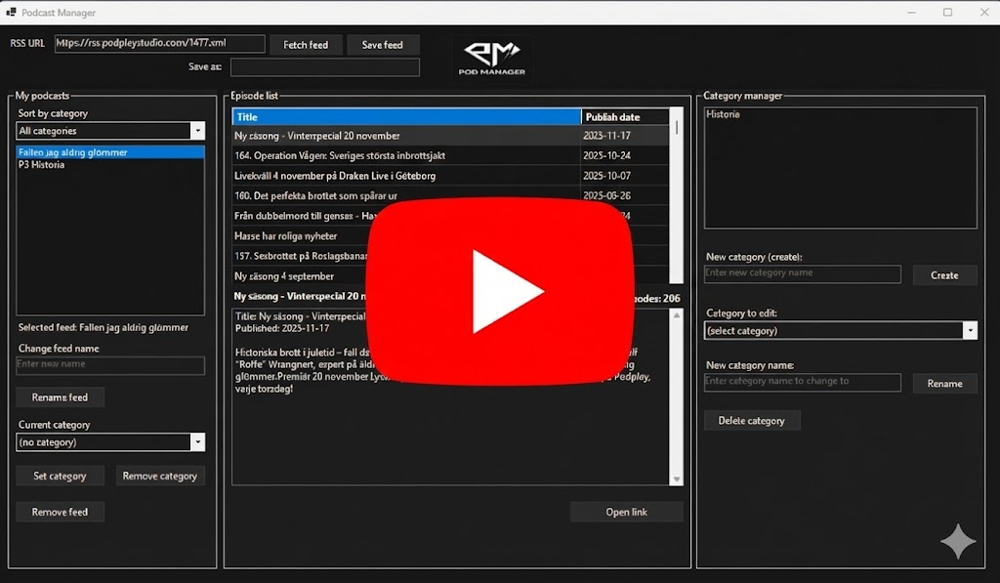

<div align="center">

# 🎧 C# Podcast Manager
**A multi-layered, transaction-safe, MongoDB-powered podcast subscription system built with C#, WinForms & Atlas.**

### <sub>📚 Developed as part of a backend engineering course at Örebro University</sub>


</div>

---

## 💡 Description

OruMongoDB Podcast Manager is a complete end-to-end system for fetching, parsing, organizing and storing podcast feeds using:

- **WinForms** for a responsive desktop GUI  
- **MongoDB Atlas** for cloud persistence  
- **Asynchronous operations** to keep the UI fast  
- **Repository Pattern** to abstract all data access  
- **ACID MongoDB Transactions** to guarantee atomic multi-write operations  
- **A clean 4-layer architecture** used in professional enterprise apps  

The goal of this project is to demonstrate real backend engineering concepts such as:

- Clean separation of responsibilities  
- Database-agnostic business logic  
- Transaction-safe write operations  
- Input validation & domain correctness  
- Robust RSS ingestion and caching  
- Professional multi-layer design  

---

## 🧰 Tech Stack

<div align="center">
  
  
  
  
</div>

---

## 🎥 Demo (YouTube)

<div align="center">
  <a href="https://youtu.be/opkW9yOqt80" target="_blank">
    
  </a>
</div>

---

## 🖼️ Screenshots

<p align="center">
  
</p>
<p align="center">The main UI showing the whole application</p>

<p align="center">
  
</p>
<p align="center">The center episode showcase showing title, publish date, total amount of episodes and the episode's descriptions</p>

<p align="center">
  
</p>
<p align="center">The podcast manager on the left side where the user can change name of the saved feeds, change/remove/give it categories, sort by categories, and also the ability to remove an entire feed</p>

<p align="center">
  
</p>
<p align="center">The category manager on the right side where the user can modify/create and also remove categories</p>

---

## 🧱 Key Architectural Highlights

* **Repository Pattern** – All data access is isolated behind interfaces. Business logic never touches MongoDB code.
* **Full Transaction Support** – Feed + episodes are written atomically using:
  - `StartSessionAsync()`
  - `session.StartTransaction()`
  - `CommitTransactionAsync()`
  - `AbortTransactionAsync()`
* **Async Everywhere** – RSS parsing, DB operations and transactions run without freezing the UI.
* **4-Layer Architecture** – Clean structuring between UI → Business → Infrastructure → Domain.
* **HTML Sanitization** – Episode descriptions are cleaned using HtmlAgilityPack.
* **Dark Mode UI** – A custom WinForms theme for a modern feel.
* 
---

## 🚀 Core Features in Detail

### ✔️ Fetch & Parse RSS Feeds
- Downloads raw RSS XML  
- Parses titles, publish dates, external links, and episode descriptions  
- Cleans all HTML using the built-in **HtmlCleaner** for safe, readable text  
- Displays episodes instantly in the WinForms UI  

---

### ✔️ Save Podcast Feed + Episodes (Atomic Operation)

Saving a feed triggers a **multi-document MongoDB transaction**, ensuring nothing is partially saved:

1. Insert the **Poddflöden** document  
2. Assign its generated `Id` to every episode  
3. Insert all **PoddAvsnitt** documents  
4. Execute `CommitTransactionAsync()`  

If **anything** fails:

- The system calls `AbortTransactionAsync()`  
- Database remains consistent  
- No half-saved feeds or episodes  

This guarantees **ACID-safe persistence** just like in real enterprise applications.

---

### ✔️ Category Management

- Create new categories  
- Rename categories  
- Delete categories  
- Assign categories to individual feeds  
- Filter feeds based on selected category  

---

### ✔️ Asynchronous Operations

All long-running processes execute via `async/await` to ensure:

- Zero UI freezing  
- Maximum responsiveness  
- Smooth user experience  

---

### ✔️ Clean Repository Pattern Implementation

All MongoDB access is abstracted behind these interfaces:

- `IPoddflodeRepository`
- `IPoddAvsnittRepository`
- `ICategoryRepository`

Benefits:

- Easy to test (mock repositories)  
- No database logic in UI or Business layer  
- Infrastructure can be replaced without touching app logic  
- Cleaner code & easier maintenance  

---

### ✔️ Robust Validation Layer

`PoddValidator` enforces:

- RSS URL format correctness  
- Valid custom feed names  
- No duplicate categories  
- A feed must be saved before category operations  
- A feed cannot be saved twice

---

## ⚙️ How to Run

### 1. Clone the project
```bash
git clone https://github.com/Nordtess/CSharp-PodcastManager
cd CSharp-PodcastManager


